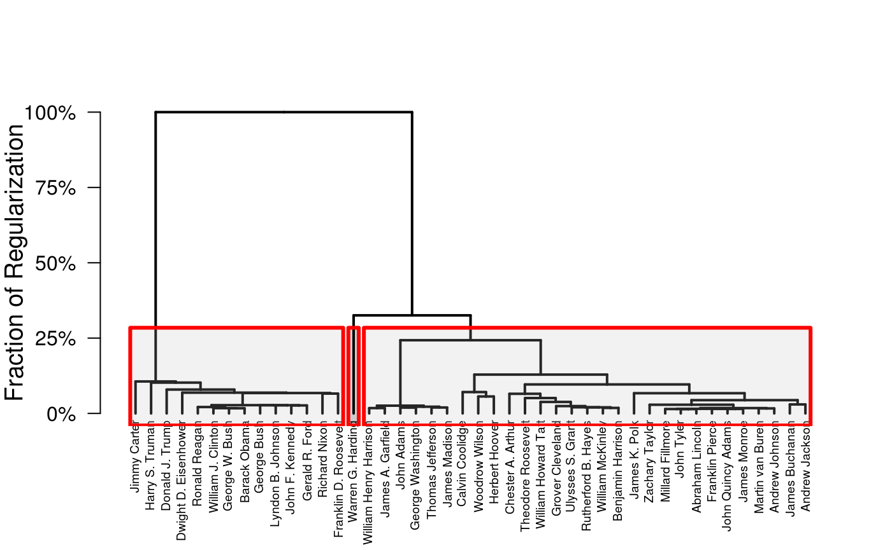
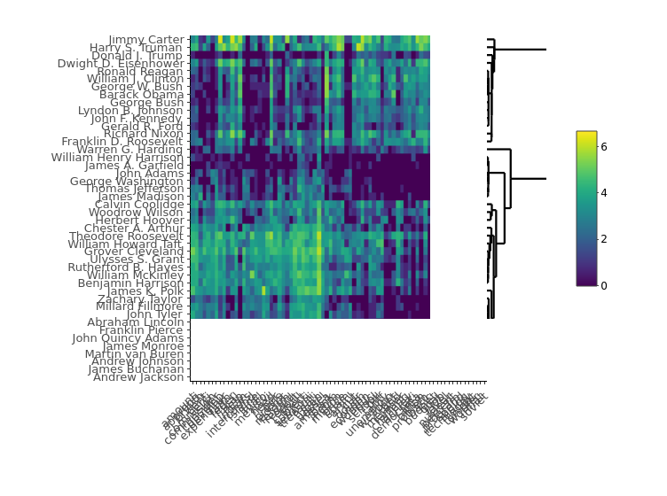
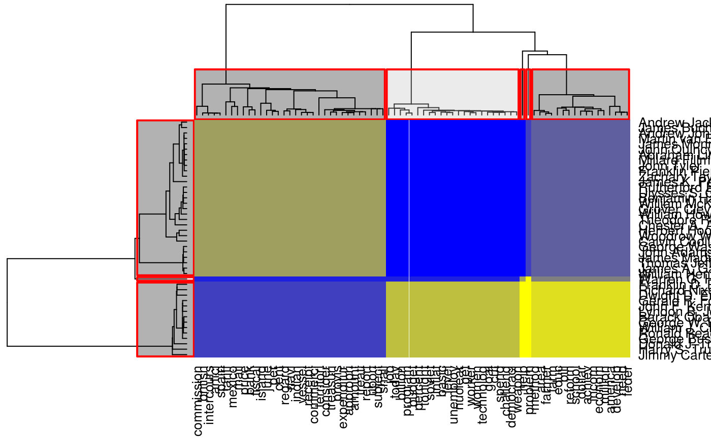
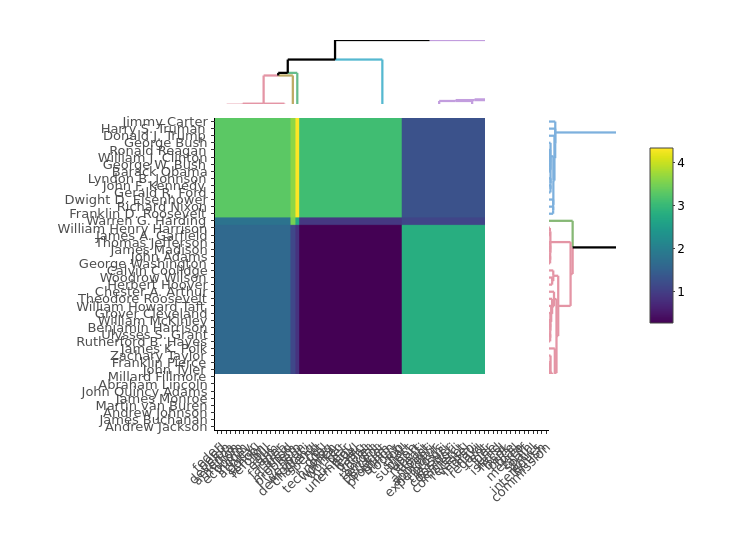
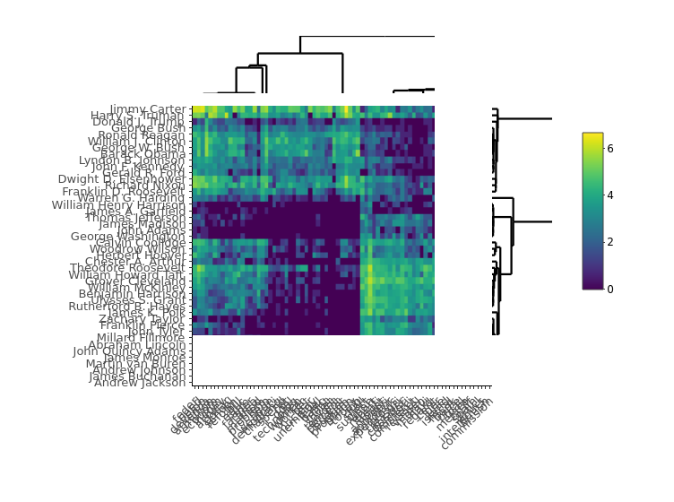

<!-- README.md is generated from README.Rmd. Please edit that file -->

[](https://travis-ci.com/DataSlingers/clustRviz)
[](https://ci.appveyor.com/project/michaelweylandt/clustRviz)
[](https://codecov.io/gh/DataSlingers/clustRviz/branch/develop)
[](https://www.gnu.org/licenses/gpl-3.0)
[](https://cran.r-project.org/package=clustRviz)
[](http://www.repostatus.org/#active)

# clustRviz

`clustRviz` aims to enable fast computation and easy visualization of
Convex Clustering solution paths.

## Installation

You can install `clustRviz` from github with:

``` r
# install.packages("devtools")
devtools::install_github("DataSlingers/clustRviz")
```

Note that `RcppEigen` (which `clustRviz` internally) triggers many
compiler warnings (which cannot be suppressed per [CRAN
policies](http://cran.r-project.org/web/packages/policies.html#Source-packages)).
Many of these warnings can be locally suppressed by adding the line
`CXX11FLAGS+=-Wno-ignored-attributes` to your `~/.R/Makevars` file.

`clustRviz` also depends on the development version of the `gganimate`
package, which is not yet on CRAN, but may be found
[here](https://github.com/thomasp85/gganimate).

## Quick-Start

There are two main entry points to the `clustRviz` package, the `CARP`
and `CBASS` functions, which perform convex clustering and convex
biclustering respectively. We demonstrate the use of these two functions
on a text minining data set, `presidential_speech`, which measures how
often the 44 U.S. presidents used certain words in their public
addresses.

``` r
library(clustRviz)
data(presidential_speech)
presidential_speech[1:6, 1:6]
#>                     amount appropri  british     cent commerci commission
#> Abraham Lincoln   3.433987 2.397895 1.791759 2.564949 2.708050   2.079442
#> Andrew Jackson    4.248495 4.663439 2.995732 1.945910 3.828641   3.218876
#> Andrew Johnson    4.025352 3.091042 2.833213 3.332205 2.772589   2.079442
#> Barack Obama      1.386294 0.000000 0.000000 1.386294 0.000000   0.000000
#> Benjamin Harrison 4.060443 4.174387 2.302585 4.304065 3.663562   3.465736
#> Calvin Coolidge   3.713572 4.094345 1.386294 3.555348 2.639057   1.609438
```

### Clustering

We begin by clustering this data set, grouping the rows (presidents)
into clusters:

``` r
carp_fit <- CARP(presidential_speech)
#> Pre-computing weights and edge sets
#> Computing Convex Clustering [CARP] Path
#> Post-processing
print(carp_fit)
#> CARP Fit Summary
#> ====================
#> 
#> Algorithm: CARP (t = 1.05) 
#> Fit Time: 0.145 secs 
#> Total Time: 0.427 secs 
#> 
#> Number of Observations: 44 
#> Number of Variables:    75 
#> 
#> Pre-processing options:
#>  - Columnwise centering: TRUE 
#>  - Columnwise scaling:   FALSE 
#> 
#> Weights:
#>  - Source: Radial Basis Function Kernel Weights
#>  - Distance Metric: Euclidean
#>  - Scale parameter (phi): 0.01 [Data-Driven]
#>  - Sparsified: 4 Nearest Neighbors [Data-Driven]
```

The algorithmic regularization technique employed by `CARP` makes
computation of the whole solution path almost immediate.

We can examine the result of `CARP` graphically. We begin with a
standard dendrogram, with three clusters highlighted:

``` r
plot(carp_fit, type = "dendrogram", k = 3)
```

<!-- -->

Examing the dendrogram, we see two clear clusters, consisting of
pre-WWII and post-WWII presidents and Warren G. Harding as a possible
outlier. Harding is generally considered one of the worst US presidents
of all time, so this is perhaps not too surprising.

A more interesting visualization is the dynamic path visualization,
whereby we can watch the clusters fuse as the regularization level is
increased:

``` r
plot(carp_fit, type = "dynamic_path")
```


`clustRviz` also provides interactive dendrograms using the
[`heatmaply`](https://cran.r-project.org/package=heatmaply) package:

``` r
plot(carp_fit, type = "js")
```

<!-- -->

### BiClustering

The use of `CBASS` for convex biclustering is similar, and we
demonstrate it here with a cluster heatmap, with the regularization set
to give 3 observation clusters:

``` r
cbass_fit <- CBASS(presidential_speech)
#> Pre-computing column weights and edge sets
#> Pre-computing row weights and edge sets
#> Computing Convex Bi-Clustering [CBASS] Path
#> Post-processing rows
#> Post-processing columns
plot(cbass_fit, k.row = 3)
```

<!-- -->

Setting `type = "js"` gives the traditional cluster heatmap:

``` r
plot(cbass_fit, type = "js", k.row = 3)
```

<!-- -->

By default, if a regularization level is specified, all plotting
functions in `clustRviz` will plot the clustered data. If the
regularization level is not specified, the raw data will be plotted
instead:

``` r
plot(cbass_fit, type = "js")
```

<!-- -->

More details about the use and mathematical formulation of `CARP` and
`CBASS` may be found in the package documentation.
